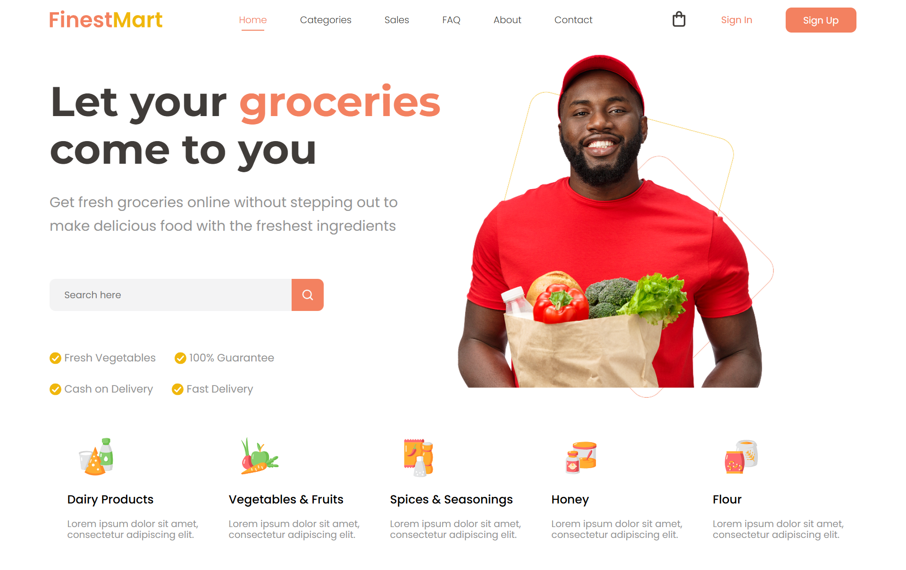

# FinestMart - Grocery Store Landing Page

Landing page moderna y funcional para una tienda de comestibles en línea. Este proyecto simula un sitio donde los usuarios pueden explorar productos frescos y realizar pedidos desde la comodidad de su hogar. Desarrollado con HTML y Sass (SCSS).

## 📑 Tabla de Contenidos

- [Introducción](#introducción)
- [Características](#características)
- [Captura de Pantalla](#captura-de-pantalla)
- [Instalación](#instalación)
- [Uso](#uso)
- [Dependencias](#dependencias)
- [Personalización](#personalización)
- [Ejemplos](#ejemplos)
- [Contribuciones](#contribuciones)
- [Autor](#autor)
- [Licencia](#licencia)

## 🧩 Introducción

FinestMart es una página de inicio ficticia para una tienda de abarrotes online. Diseñada para simular un entorno amigable, confiable y rápido, ideal para proyectos de diseño web o portafolios.

## ✨ Características

- Diseño limpio, responsivo y profesional
- Estilos construidos con Sass (SCSS)
- Sección destacada con mensaje de bienvenida e imagen representativa
- Barra de navegación: Home, Categories, Sales, FAQ, About, Contact
- Botones de autenticación: Sign In / Sign Up
- Beneficios del servicio:
  - Verduras frescas
  - Garantía del 100%
  - Entrega rápida y pago contra entrega
- Categorías de productos:
  - Lácteos, frutas y verduras, condimentos, miel, harina
- Barra de búsqueda funcional (sin backend)

## 🖼️ Captura de Pantalla



## 🚀 Instalación

1. Clona este repositorio:
```
git clone https://github.com/FrankJimenez79/grocery-store.git
```

2. Navega al directorio del proyecto:
```
cd grocery-store
```

3. Asegúrate de tener Sass instalado:
```
npm install -g sass
```

4. Compila el archivo SCSS a CSS:
```
sass style.scss style.css
```

5. Abre el archivo `index.html` en tu navegador.

## 🧪 Uso

Este diseño puede utilizarse como plantilla inicial para tiendas online, supermercados digitales o landing pages de productos alimenticios.

## 📦 Dependencias

- HTML5
- Sass (SCSS)
- No requiere frameworks ni bibliotecas externas

## ⚙️ Personalización

Modifica fácilmente:

- Textos desde `index.html`
- Estilos desde `style.scss`
- Colores, íconos e imágenes según tu producto o mercado

## 📚 Ejemplos

Perfecto para sitios de delivery, aplicaciones de supermercado, proyectos de UI/UX y portfolios de diseño web.

## 🙌 Contribuciones

¡Se agradecen contribuciones! Puedes abrir un issue o pull request con mejoras o correcciones.

## 👨‍💻 Autor

Proyecto desarrollado por **Frank Jiménez** como ejemplo de página de inicio para tienda de comestibles.
